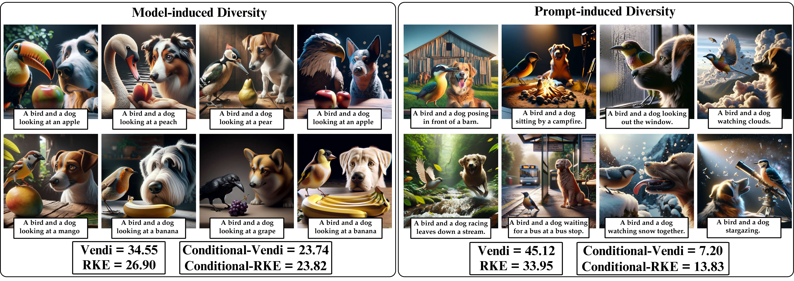

# Conditional Vendi
This Repository contains source code for paper "Conditional Vendi Score: An Information-Theoretic Approach to Diversity Evaluation of Prompt-based Generative Models"


Paper: Conditional Vendi Score: An Information-Theoretic Approach to Diversity Evaluation of Prompt-based Generative Models

Mohammad Jalali, Azim Ospanov, Amin Gohari, Farzan Farnia

**The Chinese University of Hong Kong (CUHK)**


[](https://hits.seeyoufarm.com)

## 1. Prompt-induced vs. Model-induced Diversity

Illustration of **prompt-induced diversity**, where the diversity of generated images follows the variety of prompts 
and has little variation in other details, vs. **model-induced diversity**, where the diversity of images 
for similar prompts is due to the generation model.
### Abstract

Text-conditioned generation models are commonly evaluated based on the
quality of the generated data and its alignment with the input text prompt. On
the other hand, several applications of prompt-based generative models require
sufficient diversity in the generated data to ensure the models' capability of
generating image and video samples possessing a variety of features. However,
most existing diversity metrics are designed for unconditional generative
models, and thus cannot distinguish the diversity arising from variations in
text prompts and that contributed by the generative model itself. In this work,
our goal is to quantify the prompt-induced and model-induced diversity in
samples generated by prompt-based models. We propose an information-theoretic
approach for internal diversity quantification, where we decompose the
kernel-based entropy $H(X)$ of the generated data $X$ into the sum of the
conditional entropy $H(X|T)$, given text variable $T$, and the mutual
information $I(X; T)$ between the text and data variables. We introduce the
\emph{Conditional-Vendi} score based on $H(X|T)$ to quantify the internal
diversity of the model and the \emph{Information-Vendi} score based on $I(X;
T)$ to measure the statistical relevance between the generated data and text
prompts. We provide theoretical results to statistically interpret these scores
and relate them to the unconditional Vendi score. We conduct several numerical
experiments to show the correlation between the Conditional-Vendi score and the
internal diversity of text-conditioned generative models.

## 🚀 Key Concepts

### Prompt-induced vs. Model-induced Diversity
- **Prompt-induced diversity:** The diversity of generated images follows the variety of text prompts, with little variation in other details.
- **Model-induced (Internal) diversity:** The diversity of images generated from similar or identical prompts, which is strictly due to the generative model's capabilities.

### Metrics
1. **Conditional-Vendi Score ($\exp(H(X|T))$):** Quantifies the internal, model-induced diversity independent of the variety in the input prompts.
2. **Information-Vendi Score ($\exp(I(X;T))$):** Measures the statistical alignment and relevance between the generated data and the text prompts.

## ⚙️ Installation

Clone the repository and install the required dependencies:

```bash
git clone https://github.com/mjalali/conditional-vendi.git
cd conditional-vendi
pip install -r requirements.txt
```

*(Note: If you plan to use CLIP or DINOv2 for feature extraction, ensure your environment supports PyTorch and CUDA.)*

## 💻 Usage

Below is a basic example of how to compute the Conditional-Vendi and Information-Vendi scores using our provided implementation.

```python
import torch
from conditional_vendi import compute_conditional_vendi, compute_information_vendi

# Example: Generate or load your features
# X_features: Embeddings of generated images (e.g., from CLIP)
# T_features: Embeddings of corresponding text prompts
X_features = torch.randn(1000, 512) 
T_features = torch.randn(1000, 512) 

# Calculate Conditional-Vendi Score
cond_vendi = compute_conditional_vendi(X_features, T_features)
print(f"Conditional-Vendi Score: {cond_vendi:.4f}")

# Calculate Information-Vendi Score
info_vendi = compute_information_vendi(X_features, T_features)
print(f"Information-Vendi Score: {info_vendi:.4f}")
```

## 📝 Citation

If you find this code or our paper useful in your research, please cite:

```bibtex
@inproceedings{
jalali2026conditional,
title={Conditional Vendi Score: Prompt-Aware Diversity Evaluation for Text-Guided Generative {AI} Models},
author={Mohammad Jalali and Azim Ospanov and Amin Gohari and Farzan Farnia},
booktitle={The 29th International Conference on Artificial Intelligence and Statistics},
year={2026},
url={https://openreview.net/forum?id=iDrZToIsyd}
}
```

## 📄 License
This project is licensed under the MIT License - see the [LICENSE](LICENSE) file for details.
